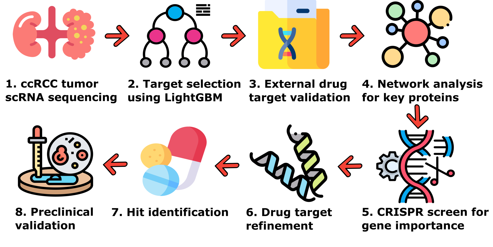

# A Systems-Level Machine Learning Approach Uncovers Therapeutic Targets in Clear Cell Renal Cell Carcinoma

[](https://doi.org/10.1038/s44386-025-00036-z)
[](https://www.nature.com/articles/s44386-025-00036-z)

> **Ruhrberg Estévez, S., Baltusyte, G., Youssef, G. et al.** A systems-level machine learning approach uncovers therapeutic targets in clear cell renal cell carcinoma. *npj Drug Discov.* **3**, 5 (2026). [https://doi.org/10.1038/s44386-025-00036-z](https://doi.org/10.1038/s44386-025-00036-z)

---

## Overview

<p align="center">
  
</p>

We present a generalisable, interpretable machine learning framework for therapeutic target discovery using single-cell transcriptomics, protein interaction networks, and drug proximity analysis. The pipeline integrates feature selection via gradient boosting classifiers, systems-level network inference, and in silico drug repurposing, enabling the identification of actionable targets with cellular specificity. As a proof of concept, we apply the method to clear cell renal cell carcinoma (ccRCC), an aggressive kidney cancer with limited treatment options. The model identifies 96 tumour-intrinsic genes, refines them to 16 targets through CRISPR screens and biological curation, and prioritises FDA-approved compounds via network-based proximity scoring. Several novel therapeutic mechanisms — including ABL1, CDK4/6, and JAK inhibition — emerge from this analysis, with predicted compounds showing superior efficacy to standard-of-care drugs across multiple ccRCC cell lines. Beyond ccRCC, this framework offers a scalable strategy for drug discovery across diverse diseases, combining machine learning interpretability with systems biology to accelerate therapeutic development.

---

## Repository Structure

```
├── 1_data_preprocessing/     # Data loading and annotation (US, Chinese, Harvard, metastatic datasets)
├── 2_feature_selection/       # UMAP visualisation, multiclass/single-class classifiers, univariate selection
├── 3_feature_validation/      # Validation across independent cohorts + ROC-AUC analysis
├── 4_drug_target_validation/  # Drug target validation across cohorts
├── 5_network_analysis/        # Protein interaction network construction, permutation tests, drug proximity
│   ├── databases/             # Network databases (PPI, drug-target)
│   └── src/                   # Network analysis source code
├── 6_drug_validation/         # Hallmark gene sets, z-values, preclinical trial analysis
├── data/                      # Gene lists, model files, predictions
├── output/                    # Generated figures (ROC curves, UMAPs)
├── rcc.yml                    # Conda environment specification
└── overview.png               # Pipeline overview figure
```

---

## Getting Started

### Prerequisites

- [Conda](https://docs.conda.io/en/latest/) or [Mamba](https://mamba.readthedocs.io/)
- R (for data preprocessing scripts in `1_data_preprocessing/`)

### Environment Setup

Create and activate the conda environment:

```bash
conda env create -f rcc.yml
conda activate rcc
```

> **Note:** The network analysis module (`5_network_analysis/`) optionally uses [graph-tool](https://graph-tool.skewed.de/), which must be installed separately via conda-forge:
> ```bash
> conda install -c conda-forge graph-tool
> ```

### Running the Pipeline

The pipeline is designed to be run in numbered order:

1. **Data Preprocessing** (`1_data_preprocessing/`) — Process raw scRNA-seq data and annotate datasets
2. **Feature Selection** (`2_feature_selection/`) — Train classifiers and perform univariate feature selection
3. **Feature Validation** (`3_feature_validation/`) — Validate selected genes across independent cohorts
4. **Drug Target Validation** (`4_drug_target_validation/`) — Validate drug targets across cohorts
5. **Network Analysis** (`5_network_analysis/`) — Build PPI networks, run permutation tests, compute drug proximity
6. **Drug Validation** (`6_drug_validation/`) — Hallmark enrichment, z-score analysis, preclinical validation

---

## Key Dependencies

| Package | Purpose |
|---|---|
| `lightgbm` | Gradient boosting classifier for feature selection |
| `scikit-learn` | Machine learning utilities and model evaluation |
| `shap` | Model interpretability via SHAP values |
| `umap-learn` | Dimensionality reduction for visualisation |
| `networkx` | Protein interaction network analysis |
| `mygene` | Gene annotation and ID mapping |
| `pyomo` | Optimisation for network proximity analysis |
| `scipy` / `statsmodels` | Statistical testing |
| `seaborn` / `matplotlib` | Plotting and visualisation |

---

## License

Please refer to the publication for terms of use.

## Citation

If you use this code, please cite:

```bibtex
@article{ruhrberg2026systems,
  title={A systems-level machine learning approach uncovers therapeutic targets in clear cell renal cell carcinoma},
  author={Ruhrberg Est{\'e}vez, S. and Baltusyte, G. and Youssef, G. and others},
  journal={npj Drug Discovery},
  volume={3},
  pages={5},
  year={2026},
  publisher={Nature Publishing Group},
  doi={10.1038/s44386-025-00036-z}
}
```
